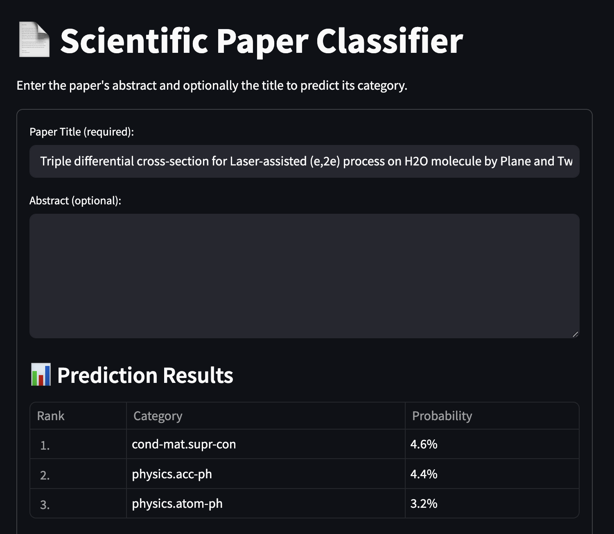
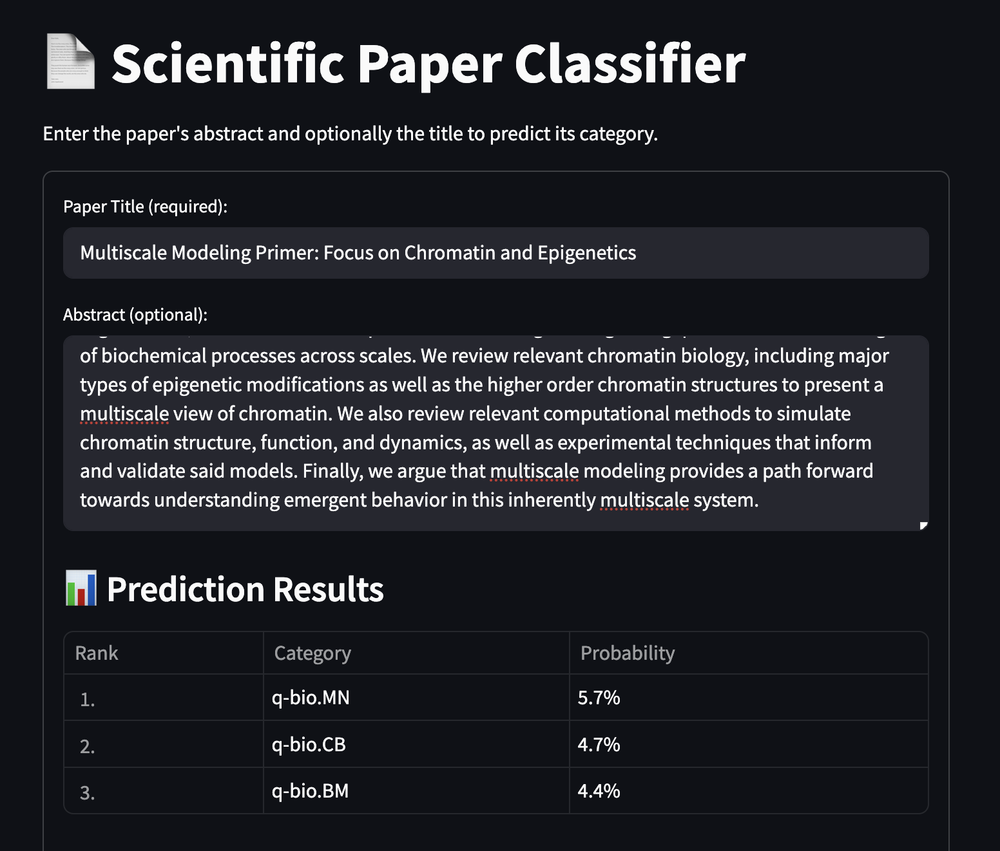

This app allows you to classify scientific papers based on their title and optionally their abstract. As a backb-end, it uses [DistilBert](https://huggingface.co/docs/transformers/en/model_doc/distilbert), fine-tuned on [Arxiv Dataset](https://www.kaggle.com/datasets/Cornell-University/arxiv). Availabel categorids are:

['cs.LG', 'hep-ph', 'hep-th', 'quant-ph', 'cs.CV', 'cs.AI', 'gr-qc', 'astro-ph', 'cond-mat.mtrl-sci', 'cond-mat.mes-hall', 'math.MP', 'math-ph', 'cs.CL', 'cond-mat.str-el', 'cond-mat.stat-mech', 'astro-ph.CO', 'math.CO', 'stat.ML', 'astro-ph.GA', 'math.AP', 'astro-ph.SR', 'astro-ph.HE', 'math.PR', 'nucl-th', 'hep-ex', 'math.AG', 'math.OC', 'physics.optics', 'cs.IT', 'math.IT', 'cond-mat.supr-con', 'math.NT', 'math.DG', 'cond-mat.soft', 'math.NA', 'cs.RO', 'math.DS', 'cs.CR', 'cs.SY', 'math.FA', 'eess.SP', 'astro-ph.IM', 'astro-ph.EP', 'physics.flu-dyn', 'stat.ME', 'hep-lat', 'eess.SY', 'cs.NA', 'math.RT', 'eess.IV', 'nucl-ex', 'cs.DS', 'physics.comp-ph', 'stat.TH', 'math.ST', 'cond-mat.dis-nn', 'cs.NI', 'cs.DC', 'physics.chem-ph', 'math.GT', 'math.GR', 'math.CA', 'physics.soc-ph', 'cs.HC', 'cs.CY', 'physics.ins-det', 'cond-mat.quant-gas', 'physics.atom-ph', 'cs.SI', 'physics.app-ph', 'stat.AP', 'cs.IR', 'cs.SE', 'math.QA', 'math.RA', 'math.CV', 'physics.plasm-ph', 'eess.AS', 'cs.LO', 'cs.SD', 'math.AT', 'physics.bio-ph', 'nlin.CD', 'cond-mat.other', 'cs.NE', 'cs.DM', 'cond-mat', 'math.LO', 'math.AC', 'math.OA', 'cs.GT', 'nlin.SI', 'q-bio.PE', 'math.MG', 'cs.CC', 'q-bio.QM', 'physics.data-an', 'physics.gen-ph', 'q-bio.NC', 'math.SP', 'nlin.PS', 'cs.DB', 'math.SG', 'math.CT', 'cs.MA', 'stat.CO', 'physics.class-ph', 'cs.PL', 'cs.CE', 'physics.acc-ph', 'physics.med-ph', 'physics.geo-ph', 'cs.MM', 'nlin.AO', 'cs.GR', 'cs.CG', 'physics.ao-ph', 'physics.space-ph', 'math.KT', 'cs.AR', 'q-bio.BM', 'q-fin.EC', 'cs.ET', 'math.GN', 'cs.FL', 'cs.DL', 'physics.hist-ph', 'econ.GN', 'cs.PF', 'econ.EM', 'math.GM', 'physics.ed-ph', 'q-bio.MN', 'math.HO', 'q-fin.ST', 'q-bio.GN', 'econ.TH', 'physics.atm-clus', 'q-fin.MF', 'q-fin.GN', 'cs.SC', 'q-fin.CP', 'physics.pop-ph', 'q-fin.RM', 'q-bio.TO', 'chao-dyn', 'cs.MS', 'q-bio.CB', 'cs.OH', 'q-fin.PR', 'q-fin.PM']

Here is some examples:

